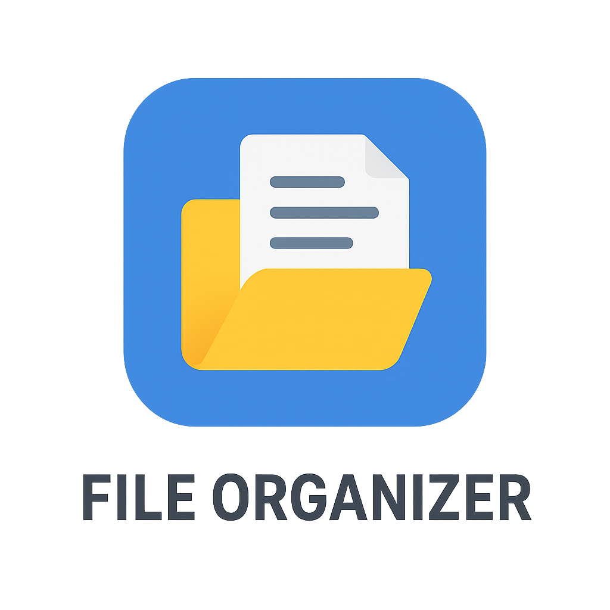

# 🎨 Advanced File Organizer

A beautiful, modern file organization system with glassmorphism UI and 20+ powerful features.



## ✨ Features

- 🎨 **6 Beautiful Themes** - Navy, Purple, Emerald, Rose, Slate, Ocean
- 💻 **Auto-Detect Projects** - Automatically finds coding projects
- 🔍 **Duplicate Finder** - Find and remove duplicate files
- 📊 **Disk Usage Analyzer** - Visual disk space analysis
- 🏷️ **File Tagging** - Organize with custom tags
- ⭐ **Favorites** - Quick access to frequent folders
- 🕐 **Recent Locations** - Track your navigation history
- 📋 **20+ Templates** - Pre-built folder structures
- ✂️ **Batch Operations** - Rename, move, copy multiple files
- 🔄 **Smart Search** - Search by name or content

## 📥 Installation

### For Users (Windows)

1. Download `FileOrganizerSetup.exe` from [Releases](../../releases)
2. Run the installer
3. Follow the wizard
4. Launch and enjoy!

### For Developers
```bash
# Clone the repository
git clone https://github.com/YOUR_USERNAME/advanced-file-organizer.git
cd advanced-file-organizer

# Install dependencies
pip install -r requirements.txt

# Run the application
python main.py
```

## 🔨 Building from Source
```bash
# Install build tools
pip install pyinstaller

# Build executable
python -m PyInstaller FileOrganizer.spec --clean

# Create installer (requires Inno Setup)
# Download from: https://jrsoftware.org/isdl.php
build.bat
```

## 🎯 Usage

1. **Choose a Theme** - Select from 6 beautiful themes
2. **Navigate** - Use breadcrumbs and quick access
3. **Organize** - Apply templates or create custom structure
4. **Search** - Find files instantly
5. **Batch Operations** - Select multiple files for bulk actions

## ⌨️ Keyboard Shortcuts

- `Ctrl+N` - New File
- `Ctrl+Shift+N` - New Folder
- `Ctrl+C/X/V` - Copy/Cut/Paste
- `Delete` - Delete Files
- `F2` - Rename
- `F5` - Refresh
- `Ctrl+F` - Search
- `Ctrl+A` - Select All

## 📸 Screenshots


## 🛠️ Technologies

- Python 3.8+
- PyQt6 - Modern GUI framework
- Pillow - Image processing
- send2trash - Safe file deletion
- watchdog - File system monitoring

## 📝 License

MIT License - see [LICENSE.txt](LICENSE.txt)

## 🤝 Contributing

Contributions welcome! Feel free to:
- Report bugs
- Suggest features
- Submit pull requests

## 👨‍💻 Author

Created by TheCo

## ⭐ Show Your Support

Give a ⭐ if this project helped you!